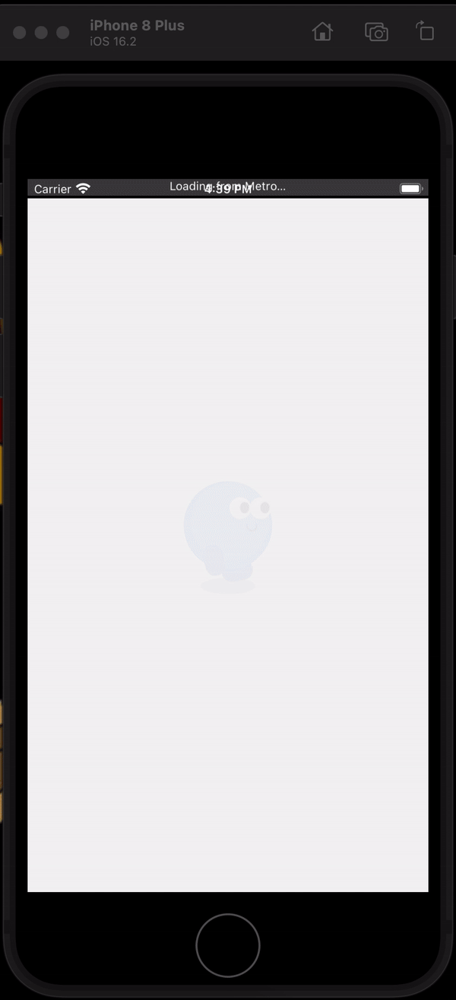

# React Native Lottie Example

This project demonstrates how to integrate and use Lottie animations within a React Native application.



## Features

- Demonstrates basic Lottie integration with React Native
- Provides an example of using an external Lottie JSON file
- React Navigation integration

## Requirements

- Node.js
- npm or yarn
- React Native development environment set up

## Installation

1. Clone the repository:

   ```bash
   git clone https://github.com/PrayagJoshi10/LottieSplash.git
   ```

2. Navigate to the project directory:

   ```bash
   cd LottieSplash
   ```

3. Install dependencies using yarn:

   ```bash
   yarn install
   ```

## Usage

1. Start the Metro bundler:

   ```bash
   npx react-native start
   ```

2. Run the application on a connected emulator or device:

   ```bash
   npx react-native run-android
   # or
   npx react-native run-ios
   ```

3. Explore the custom drawer navigation and animations in the demo app.

## Dependencies

- React Navigation: For managing navigation in the React Native app.
- lottie-react-native: https://github.com/lottie-react-native/lottie-react-native

## Note for IOS

For installing pod in IOS

Instead of `pod install`

### use

```bash
cd ios

USE_FRAMEWORKS=static NO_FLIPPER=1 pod install
```

## Author

Prayag Joshi
